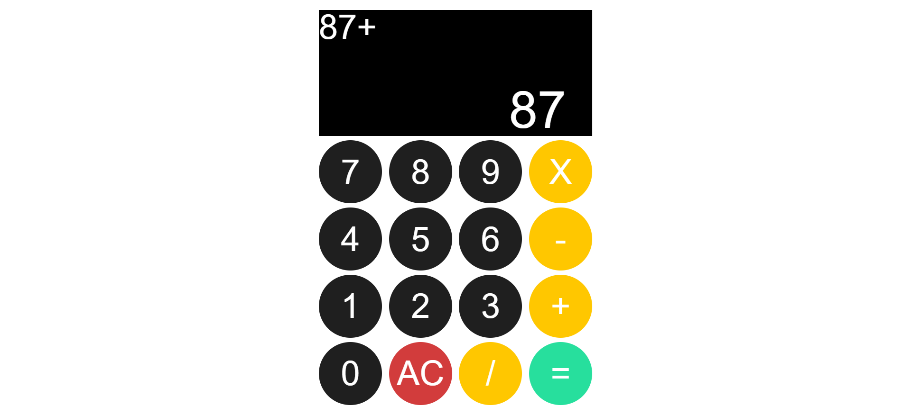

# simple-calculator

This project is a simple calculator that performs the four basic mathematical operations.

The project was developed with the aim of practicing concepts learned in my personal front end studies, using only HTML, CSS and Vanilla JS.

You can see the result obtained in the image below:

